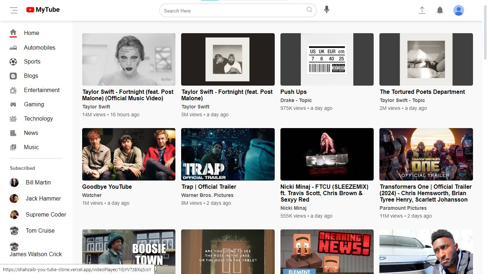

# YouTube Clone Developed with React + Vite

I Built a fully functional, responsive and beautiful Personal Portfolio Website using JavaScript, HTML and 
CSS, Git and Github, Redux Toolkit and ECMA Script on ReactJs. This Personal Portfolio is enriched with 
advanced JavaScript and ECMA Script methods. This Portfolio website is available on my Github ID. I have
also hosted this website on Vercel. at this address https://shahzaib-khan-portfolio.vercel.app to 
make it available to the public.

Currently, available on:

- [Vercel](https://shahzaib-khan-portfolio.vercel.app).

